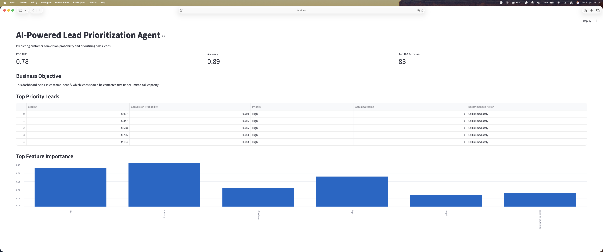

# AI-Powered Lead Prioritization Agent

## Overview

This project builds a machine learning based system that helps sales and marketing teams decide which leads to contact first under limited call capacity.

The system predicts the probability that a customer will subscribe to a term deposit and translates these predictions into actionable recommendations through a machine learning driven decision layer.

---

## Business Problem

Sales teams cannot contact every potential customer. This project helps prioritize leads by identifying those with the highest likelihood of conversion.

---

## Data

The project uses the publicly available Bank Marketing Dataset from the UCI Machine Learning Repository.

Target variable:

- `y` → whether the client subscribed (yes/no)

---

## Approach

### 1. Data Preparation

- Removed leakage variable (`duration`)
- Encoded categorical variables
- Split into training and test sets

### 2. Modeling

- Logistic Regression (baseline model)
- Random Forest (performance comparison)
- Evaluation using ROC AUC

### Model Performance

| Model | Accuracy | ROC AUC |
|---------|---------:|---------:|
| Logistic Regression | 0.89 | 0.76 |
| Random Forest | 0.89 | 0.78 |

The Random Forest model achieved slightly better ranking performance and captured more complex relationships in the data.

### 3. Lead Scoring

- Each customer receives a conversion probability
- Leads are ranked according to predicted likelihood

### 4. Agent Layer

The system translates predictions into business actions:

- Priority level (High / Medium / Low)
- Explanation of prediction
- Recommended next action
- Manager ready summary

---

## Dashboard

A Streamlit dashboard provides:

- Top leads
- Conversion probabilities
- Priority levels
- Key insights

The dashboard is designed for operational sales usage and allows teams to quickly identify high priority leads under limited outreach capacity.

---

## Business Value

- Reduces wasted calls
- Improves conversion efficiency
- Supports better allocation of sales resources

---

## Limitations

- Model predictions are probabilistic rather than certain
- The model should support decision making, not replace it
- Historical data may contain bias

---

## Tech Stack

- Python
- Pandas
- Scikit-Learn
- Streamlit
- Matplotlib

## Key Insights

### Logistic Regression

The Logistic Regression model highlighted interpretable drivers of conversion probability such as:

- Previous campaign success
- Contact month
- Education level
- Marital status

### Random Forest

The Random Forest model identified additional non-linear patterns and ranked the following variables as most important:

- Account balance
- Age
- Contact day
- Number of campaign contacts
- Previous campaign outcome

The Random Forest slightly outperformed Logistic Regression in ROC AUC performance.

---

## Future Improvements

Potential next steps include:

- Hyperparameter tuning
- Cross validation
- SHAP based explainability
- Real-time lead scoring API
- Cloud deployment

---

## Dashboard Screenshot



---

## Project Structure

```text
AI-Lead-Prioritization-Agent/
├── app/
├── data/
│   ├── bank-full.csv
│   └── top_leads.csv
├── notebooks/
│   └── 01_eda.ipynb
├── screenshots/
│   └── dashboard.png
├── src/
├── README.md
└── requirements.txt
```

---

## Project Purpose

This project demonstrates skills in:

- Machine Learning
- Predictive Analytics
- Business Intelligence
- Lead Scoring
- Data Visualization
- Decision Support Systems

---

## Author

**Oliver de Bruin**

Bachelor International Business Administration

Areas of interest:

- Business Intelligence
- Data Analytics
- Artificial Intelligence
- Strategy
- Automotive Industry